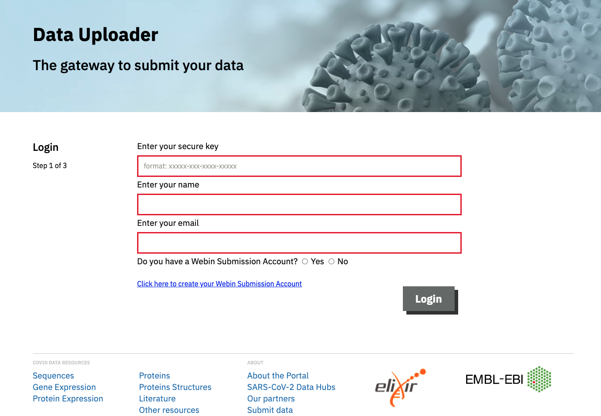

# Drag-and-Drop Submission Tool

Studies, samples and data files can all be submitted in a single step using our drag-and-drop uploader tool. Metadata for all object types is provided in a single spreadsheet and uploaded along with your data files. A user support bioinformatician at the ENA will pick up your files and perform the submission on your behalf.

```{warning}
Please note : due to the manual nature, this tool is only suitable for infrequent submission of small-to-meduim-scale datasets. For frequent or larger scale submissions, please consider another method covered in this workshop.
```

## Steps

- Register your interest in using this tool by filling in [this form](https://www.covid19dataportal.org/submit-data/viral-sequence-form), providing us with some basic details about your dataset. If the tool is suitable for your assign your use case, a secure key will be assigned to you and we will send a metadata spreadsheet template.

- Populate the spreadsheet template with your own metadata. Please find a version of this spreadsheet populated using the example data we've used throughout this workshop in the `example_data/drag_and_drop` folder.

- Log in to your upload area through our [uploader webpage](https://ebi-ait.github.io/sars-cov2-data-upload/) using your secure key.

<br/>

- Simply drag the populated spreadsheet and associated data files into the upload box on the webpage. Once upload has completed, our team will be notified and we will begin your submission. 


```{note}
Our user support bioinformatician will validate your spreadsheet and data prior to submission. If there are any issues, we will reach out to you to support you to correct the problem.
```

For full documentation, please see [here](https://ebi-ait.github.io/sars-cov2-data-upload/app-documentation).

```{tip}
Finally, we'll move on to some [brokering-specific information](data_brokering).
```
