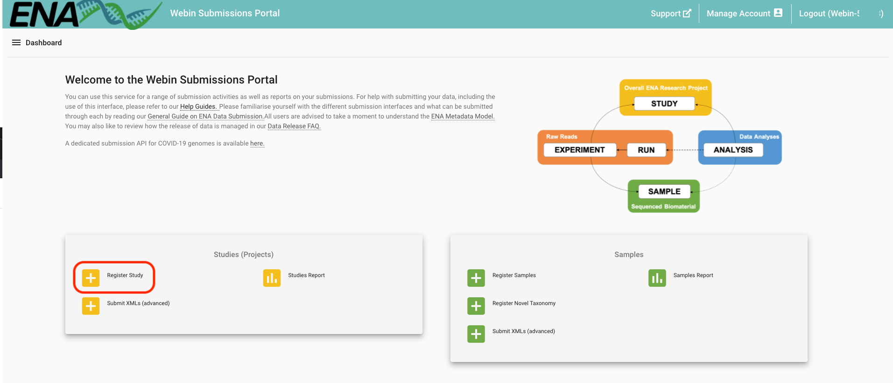
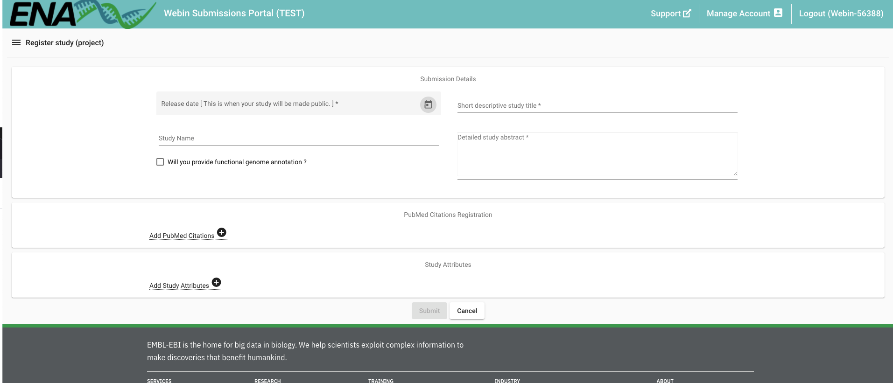

# Registering a Study

Let's start by registering a study. There are 2 ways to do so: interactively through our 
[Webin Submission Portal](https://wwwdev.ebi.ac.uk/ena/submit/webin/login), or programmatically
using cURL.

## Interactive

Head over to the [Webin Submission Portal](https://wwwdev.ebi.ac.uk/ena/submit/webin/login)
and log in using your Webin credentials to access the landing page.  Here, menus are color-coded
in line with the metadata model. Study-related items are in yellow. Click on the 'Register Study'
button.



Fill out info here: 



You're done!

## Programmatic

Programmatic submissions generally require files in XML format. To register a new study,
we will need 2 XML files:

- one XML to define the study metadata
- and another to define the submission action

Examples of both of these files are available in the example materials unzipped earlier (see [Workshop Setup](#workshop-setup)).
Navigate to the `example_data/study/programmatic` directory to find the example files:

```bash
export WORKSHOP=/path/to/example_data/
cd $WORKSHOP/study/programmatic/
ls
```

As covered in the video on our metadata model, aliases are an important way to identify and
link your data. Please edit `project.xml` to create a project alias that is unique to you.
Once complete, you are ready to send both XMLs to our test service using cURL:

```bash
curl -u username:password -F "SUBMISSION=@submission.xml" -F "PROJECT=@project.xml" "https://wwwdev.ebi.ac.uk/ena/submit/drop-box/submit/"
```

```{note}
The `submission.xml` file used here defines the `<ADD/>` action. This means that we are requesting
a _new_ project.

Other actions include `<MODIFY/>` to submit changes to existing objects, or `<HOLD/>` to define
when your data should become public. For more information, see 
[our submission XML documentation](https://ena-docs.readthedocs.io/en/latest/submit/general-guide/programmatic.html#submission-xml).
```

After running the above command, you will recieve a reply in the form of a 'receipt XML'. This 
will contain information about the contents and success of your submission, as well as your study accession.
It is very important take note of your study accession as we will use this later to submit other objects to this study.

For more general information on programmatic study registration, please see [our documentation](https://ena-docs.readthedocs.io/en/latest/submit/study/programmatic.html).

```{tip} 
Now we have a study to hold our data, let's move on to [registering samples](register_samples.html).
```
