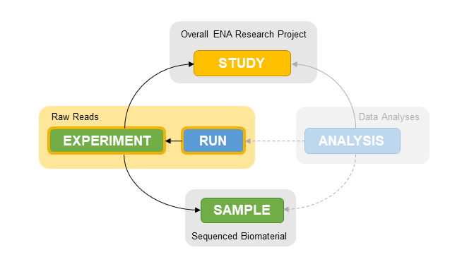

# Submitting Raw Sequencing Read Data

While it is possible to submit raw sequencing read data both interactively and programmatically using similar interfaces to those used in previous exercises, it is not the recommended route. This is because files need to be uploaded to your personal dropbox area on our servers using [a range of options](https://ena-docs.readthedocs.io/en/latest/submit/fileprep/upload.html) prior to metadata submission.

We recommend using our command line interface Webin-CLI for submission of data files, as it will perform file upload automatically at time of metadata submission, making it a one step process instead of two.

For this part of the workshop, we will submit the example paired fastq files in the `reads/` directory to our samples.

```bash
cd $WORKSHOP/reads/
ls *.fastq.gz
```

## Webin-CLI

Webin-CLI is a Java-based utility for simultaneously uploading and submitting different types of data files. If you haven't already done so, please see [here](https://github.com/enasequence/webin-cli/tree/v4.1.0#readme) for information on download and setup of this tool.

The main input to the Webin-CLI application is a manifest file. Included in the `reads/webin-cli/` directory are manifest files for each sample. Please open `paired_fastq_manifest_sample1.txt` to see the format of these types of files, and what metadata is listed there. In the case of reads, this largely covers information about library preparation and sequencing platform. For information on permitted values, see [here](https://ena-docs.readthedocs.io/en/latest/submit/reads/webin-cli.html#metadata-validation).

```{note}
In order to link the data files to the objects we've already created (study, samples), we must add the accessions received in previous steps to the manifest files.
Please replace the `STUDY` and `SAMPLE` fields with your own accessions in each file prior to submission.
```

First, using the `-context reads` setting in Webin-CLI, we will validate our submission using the `-validate` flag. This checks for errors in the manifest fields.

```bash
java -jar webin-cli-4.2.0.jar -context reads -manifest webin-cli/paired_fastq_manifest_sample1.txt -userName user -password pass -test -validate
```

If this passes validation, we can replace the `-validate` flag with `-submit` to perform the submission.

```{warning}
Please use the `-test` flag to submit to our test service
```

```bash
java -jar webin-cli-4.2.0.jar -context reads -manifest webin-cli/paired_fastq_manifest_sample1.txt -userName user -password pass -test -submit
```

Do this for all 3 manifest files. As always, please note down the resulting run accessions (`ERR` numbers) for use later.

```{tip}
Reads have now been submitted to your samples. Feel free to move on to [submitting sequences](../submit_sequences.html) if you do not intend to use the other submission methods listed below.
```

## Data Upload

Before programmatic or interactive submission, you must upload your data files (`.fastq.gz` in this case) to your dropbox area on our servers. In order to check for successful file transfers, we must compute [MD5s](https://en.wikipedia.org/wiki/MD5) for each file prior to upload. For example:

```bash
for s in SARS-CoV-2-Sample*
> do
> md5 $s
> done
MD5 (SARS-CoV-2-Sample1_1.fastq.gz) = a5e42219e299c1a0bcadd2b67bf7b32d
MD5 (SARS-CoV-2-Sample1_2.fastq.gz) = df4480daa2e9b4c2dfa7c5384b281e11
MD5 (SARS-CoV-2-Sample2_1.fastq.gz) = 75c798a4f452ef5cb1ee7ab0c2df250c
MD5 (SARS-CoV-2-Sample2_2.fastq.gz) = cbc484055e1c82814d62e8dc62088f19
MD5 (SARS-CoV-2-Sample3_1.fastq.gz) = 29e51011d86ad0c8fc8681d50136dffc
MD5 (SARS-CoV-2-Sample3_2.fastq.gz) = 9cb639082ebf3c3172ba595602b3f07e
```

Next, select the most convenient upload option for your system from our [range of options](https://ena-docs.readthedocs.io/en/latest/submit/fileprep/upload.html). Upload all 3 pairs of files.

## Programmatic

As in previous steps, this type of submission is performed using XML files. In the case of reads, we must submit 2 types of object: experiments and reads. Experiments hold information about library preparation and sequencing protocols, and link to studies and samples.  Runs simply link experiments and data files.



Please find example XMLs for both experiments and reads in the `reads/programmatic` directory and make the following edits:
1. in `experiments.xml`, replace all occurrences of `PRJEB####` with your study accession, and all occurrences of `SAME######` with the equivalent sample accessions.
2. in `runs.xml`, replace the `checksum` field in each `<FILE>` tag with those that you computed earlier. These will be used to check for file corruption that may have occurred during upload.

Note that runs reference experiments by their aliases. E.g.
- in `experiments.xml`: `<EXPERIMENT alias="SARS-CoV-2 experiment 1">`
- in `runs.xml`: `<EXPERIMENT_REF refname="SARS-CoV-2 experiment 1" />`

```{note}
In all object referencing/linking (using `<*_REF>` tags), we can link by either alias, using `refname=""` or by accession, using `accession=""`
```

As with previous programmatic submissions, we will send these XML files to our test service using cURL:
```bash
curl -u username:password -F "SUBMISSION=@submission.xml" -F "EXPERIMENT=@experiments.xml" -F "RUN=@runs.xml" "https://wwwdev.ebi.ac.uk/ena/submit/drop-box/submit/"
```

## Interactive

Runs can be created through the [Webin Submissions Portal](https://wwwdev.ebi.ac.uk/ena/submit/webin/) using a tab-delimited (`.tsv`) spreadsheet. Please find an example spreadsheet in the `reads/interactive/` folder.

In this spreadsheet, there are several fields you will need to update in order to correctly link and validate your data files.
1. replace all occurrences of `ERS#######` with your equivalent sample accessions
2. replace all occurrences of `PRJEB#####` with your equivalent study accession
3. replace both `forward_file_md5` and `reverse_file_md5` fields with the hashes you calculated earlier - these will be used to check for file corruption during upload

In the Webin Submissions Portal dashboard, the reads menu is colour coded in orange. Choose the 'Submit Reads' button and upload the spreadsheet.

```{tip}
Reads have now been submitted to your samples. Let's move on to [submitting sequences](submit_sequences.html).
```
